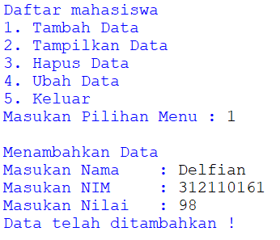

# Delfian Ruly Havatilla
# TI.21.A1

**Tugas Praktikum - Pertemuan 13**

Berikut adalah tambahan kode eksepsi.
~~~

while True:
        try:
            nim = int(input("Masukan NIM\t: "))
            if nim == "":
                print("NIM tidak boleh kosong")
            else:
                break
        except:
            print("Harap Masukan Angka")
        else:
            break
        
while True:
        try:
            nilai = int(input("Masukan Nilai\t: "))
            if nilai == "":
                print("Nilai tidak boleh kosong")
            else:
                break
        except:
            print("Harap Masukan Angka")
        else:
            break

~~~

Dengan menambahakan eksepsi maka:
- Saat input data kosong maka akan meminta untuk memasukan data kembali
- Saat input NIM dan Nilai menggunakan karakter maka program akan meminta untuk memasukan angka.

Tampilan dari menu input data.\

